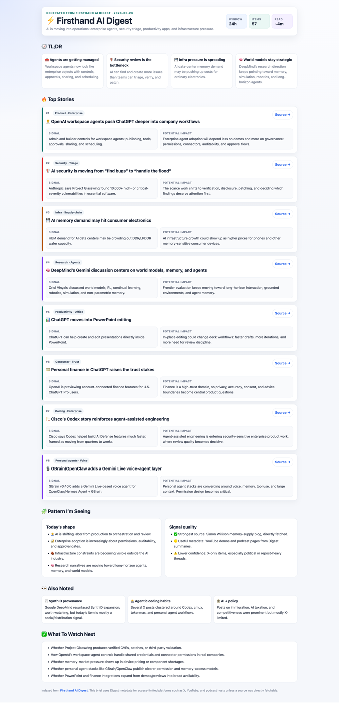

# Firsthand AI Digest Skill

A small agent skill for turning [Firsthand AI Digest](https://ai.prov1dence.top/) into a visual daily AI news brief.

It scans the last 24 hours of AI news, picks the most important signals, and asks your agent to produce a clean HTML page that you can read in a few minutes.



## Quick Start: Copy This Link

Give this repository link to your agent:

```text
https://github.com/chr1sc2y/firsthand-ai-digest-skill
```

Or, if your agent prefers SSH:

```text
git@github.com:chr1sc2y/firsthand-ai-digest-skill.git
```

Then say:

```text
Import and use this skill/agent pack:
https://github.com/chr1sc2y/firsthand-ai-digest-skill

Create a daily 7 AM automation for Firsthand AI Digest, and also run it once now.
The output should be a short visual HTML brief.
```

If the agent can clone GitHub repos and write files, it should be able to load the instructions from this repo automatically. If it cannot install skills automatically, it can still read `AGENTS.md`, `CLAUDE.md`, or `references/agent_contract.md` and follow the workflow.

## What It Does

- Collects the latest 24 hours from Firsthand AI Digest
- Filters items by the site's timestamp data
- Avoids slow raw fetching for X, YouTube, LinkedIn, podcasts, and short links
- Uses original sources only when they are important enough
- Produces a simple visual HTML brief with:
  - TL;DR
  - ranked top stories
  - source links
  - signal and potential impact
  - patterns and watchlist

## Codex / Codex Cloud

Paste this into Codex or Codex Cloud:

```text
Import this repository as a Skill and use it:
https://github.com/chr1sc2y/firsthand-ai-digest-skill

Create a daily 7 AM automation for Firsthand AI Digest and run today's brief once.
```

After import, you can also invoke the skill directly:

```text
Use $ai-providence-daily to create the daily 7 AM automation and run today's Firsthand AI Digest HTML brief once.
```

Codex will create a daily automation and generate a self-contained HTML brief named:

```text
firsthand-ai-digest-brief.html
```

## Claude Code / OpenClaw / Other Agents

This repo also includes portable agent instructions:

- `AGENTS.md` for general agents
- `CLAUDE.md` for Claude Code
- `references/agent_contract.md` for a platform-neutral workflow
- `references/automation_prompt.md` for the actual brief-generation prompt

Paste this into your agent:

```text
Use this repo as an agent pack:
https://github.com/chr1sc2y/firsthand-ai-digest-skill

Read the repo instructions, run the 24-hour Firsthand AI Digest workflow once, and generate the HTML brief.
```

If your agent supports scheduled jobs, ask it to schedule the task for every day at 7 AM.

## Run Once Manually

From the repo root:

```bash
python3 scripts/run_once.py --hours 24 --output firsthand-ai-digest-source-pack.md
```

This creates a source pack. The source pack is not the final brief; it is the input your agent uses to write the final HTML page.

## Output Style

The preferred output is a single HTML file with no build step and no external dependencies.

The page should be short, visual, and easy to scan:

- compact header
- TL;DR cards
- one-row story cards
- `Source`, `Signal`, and `Potential impact`
- low-priority notes at the bottom

## Notes

The script is intentionally lightweight. It does not try to fully crawl X, YouTube, LinkedIn, podcasts, or short-link services because those pages are often slow, login-gated, or anti-bot protected. Instead, it uses Firsthand AI Digest metadata by default and lets the agent open only the most important sources when needed.
